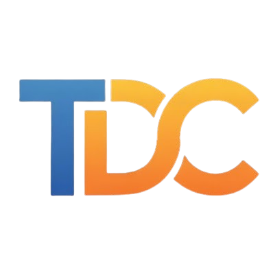

#  TUTODECODE

**Votre académie IT personnelle : 100% locale, performante et boostée à l'IA.**

---

## 🏢 À propos de l'Association TUTODECODE

> **Notre Mission Officielle :**
> *« Promouvoir l'apprentissage de l'informatique et du numérique sous toutes ses formes, créer et diffuser des contenus pédagogiques, tutoriels et documentations techniques accessibles à tous, gérer et administrer la plateforme internet dédiée à ces activités et favoriser l'entraide ainsi que le partage de connaissances entre passionnés et débutants. »*

## 💡 L'Apprentissage Repensé

TUTODECODE est une plateforme d'apprentissage technique portée par notre association à but non lucratif. Elle est conçue pour vous offrir un environnement riche, fluide et totalement indépendant du cloud. Montez en compétence sur les technologies d'aujourd'hui (Linux, Docker, Python, SQL) sans jamais dépendre d'une connexion internet ou sacrifier vos données personnelles.

### Pourquoi choisir TUTODECODE ?

*   **Privacy-First (100% Local)** : Vos cours, vos progressions et vos échanges avec l'IA ne quittent jamais votre machine.
*   **Performances Natives** : Une interface soignée, réactive et optimisée, développée avec Flutter pour tous vos écrans.
*   **Open Source** : Un projet transparent sous licence AGPL-3.0, garantissant que le code source reste librement consultable.

---

## ✨ Fonctionnalités Clés

### 🎓 Parcours Pédagogiques
Accédez à une bibliothèque de cours interactifs et structurés couvrant le développement, l'administration système et les fondamentaux de l'informatique.

### 💻 Laboratoires et Simulateurs
Pratiquez directement dans l'application. Nos interfaces simulent des terminaux et des environnements de configuration pour tester vos connaissances en temps réel, sans risque de casser votre système.

### 🧠 Ghost AI : Votre tuteur de poche
Bloqué sur un concept complexe ? **Ghost AI** est intégré directement à la plateforme. Propulsé localement par le moteur **Ollama**, il vous guide pas à pas et répond à vos questions techniques sans aucun appel réseau vers des serveurs externes.

---

## 🔒 Philosophie : La Souveraineté Numérique Expliquée

Souvent perçue comme un mot-valise ou réservée aux institutions d'État, la **souveraineté numérique** prend ici tout son sens pratique pour vous, en tant qu'utilisateur. Dans le contexte de TUTODECODE, cela se traduit par 3 garanties concrètes :

1. **Vous possédez vos données** : L'application ne contient aucun outil de pistage (tracker), n'envoie rien vers un cloud externe et ne collecte aucune de vos métriques d'apprentissage.
2. **Indépendance totale** : Vous n'avez besoin d'aucun compte en ligne (Google, Microsoft, AWS) pour utiliser nos simulateurs. Même notre Intelligence Artificielle (Ghost AI) tourne directement sur le processeur ou la carte graphique de *votre* propre ordinateur.
3. **Pérennité (Anti-obsolescence)** : Si les serveurs de TUTODECODE venaient à fermer demain, votre application continuerait de fonctionner parfaitement et à vie, car elle est conçue pour être 100% autonome.

En résumé : **Être souverain avec TUTODECODE, c'est garder le contrôle absolu sur ses outils et sa vie privée, sans compromis sur la technologie.**

### Vérification de l'intégrité

Nous concevons TUTODECODE comme un outil robuste. Afin de garantir l'authenticité de nos versions (particulièrement sur l'écosystème Windows), nous signons nos exécutables avec un certificat d'édition officiel.  
*Empreinte SHA-256 du certificat racine :* `AECDCE889EBA76FD10672FCFE79B32FE8BB29D75`

> [!NOTE]  
> **Transparence et Intégrité du Code**
> TUTODECODE est développé autour d'un noyau centralisé pour garantir une stabilité et une sécurité maximales de l'environnement d'apprentissage. 
> Bien que le code source soit auditable librement, l'intégration de nouvelles fonctionnalités au cœur du système (Pull Requests) n'est actuellement pas ouverte au public, afin de préserver la chaîne de confiance de l'application. 
> 
> Vous pouvez néanmoins fourcher (fork) le projet selon les termes de la licence AGPL-3.0, ou ouvrir une *Issue* pour toute suggestion !

---

## 📥 Téléchargements

| Plateforme | Fichier | Type |
| :--- | :--- | :--- |
| **Android** | `TUTODECODE.apk` | Application mobile & tablette |
| **Windows** | `TUTODECODE.msix` | Application Desktop (Installation native) |
| **Windows** | `TUTODECODE-Public.cer` | Certificat racine (Requis pour l'installation MSIX) |
| **Linux** | `TUTODECODE.tar.gz` | Archive binaire compilée |

---

## 🚀 Guide d'Installation Rapide

### Windows (Recommandé)
Pour utiliser le format d'application Windows `.msix` moderne, l'OS exige que l'application soit signée. Notre projet étant 100% gratuit et open source, nous utilisons un **certificat auto-signé** (plutôt qu'un certificat commercial très onéreux). C'est pourquoi vous devez l'installer manuellement :

1. Téléchargez `TUTODECODE-Public.cer` et `TUTODECODE.msix`.
2. **Installez le certificat** : Double-cliquez sur le fichier `.cer` -> *Installer le certificat* -> *Machine locale* -> *Placer dans* -> **Autorités de certification racines de confiance**.
3. Lancez l'installation de l'application via le fichier `.msix`.

> [!TIP]
> **Vérifier l'authenticité de l'application :** 
> Si vous souhaitez vous assurer que le fichier que vous téléchargez est bien l'original, ouvrez PowerShell et tapez : 
> `certutil -hashfile \chemin\vers\TUTODECODE-Public.cer SHA256`
> Le résultat doit être identique à l'empreinte affichée plus haut dans la section sécurité.

### Android
1. Téléchargez le fichier `TUTODECODE.apk`.
2. Autorisez temporairement l'installation d'applications de sources inconnues dans vos paramètres de sécurité.
3. Installez et lancez TUTODECODE.

### Activer Ghost AI (Ollama)
Pour débloquer l'assistant IA local :
1. Installez le moteur [Ollama](https://ollama.com).
2. Ouvrez un terminal et téléchargez un modèle léger et performant (ex: `ollama pull qwen2.5:1.5b` ou `ollama pull phi3`).
3. Relancez TUTODECODE : la plateforme détectera automatiquement votre modèle au démarrage.

---

## 📄 Licence
Ce projet est distribué sous licence **GNU Affero General Public License v3.0 (AGPL-3.0)**. 
Un exemplaire détaillé est disponible dans le fichier `LICENSE` à la racine du projet.

---
© 2026 Association TUTODECODE  
*Apprenez en toute liberté.*
